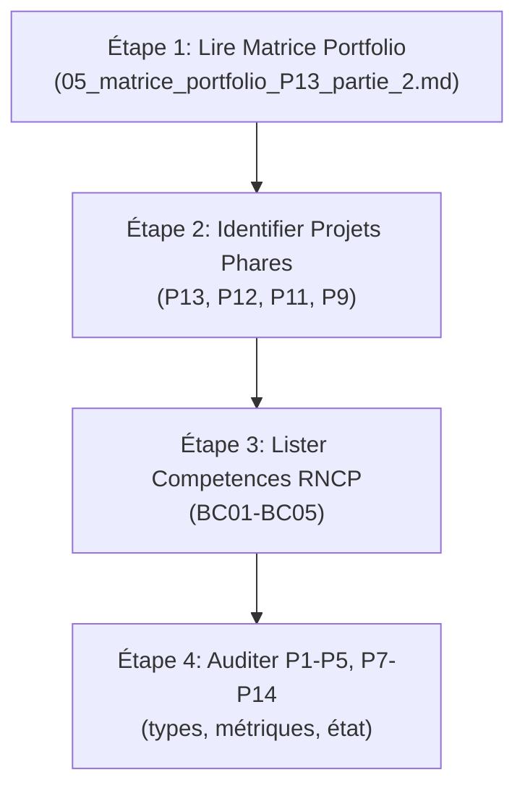

# 📚 **Partie 2 – Valorisation du Portfolio – Guide Intégration Complet**

*Documentation complète pour construire, organiser et publier votre portfolio data sur GitHub Pages*

---

## **🎯 Objectif de Partie 2**

**Transformer 14 projets (P1-P14) + Gouvernance IA (P13 Partie 1) en portfolio professionnel consultable sur GitHub Pages.**

---

## **📋 Documents de Référence**

### **1. Matrice Portfolio** (`05_matrice_portfolio_P13_partie_2.md`)

**Contenu** :
- Inventaire complet de 14 projets (P1-P14)
- Statut de chaque projet (Complet, En cours, À auditer)
- Mapping competences RNCP 37837 (BC01-BC05)
- Priorités d'action (🔴 Critique, 🟠 Haute)

**Utilité** : 
- ✅ Vue d'ensemble du portfolio
- ✅ Identifier projets phares
- ✅ Planifier audit des 12 autres projets

**À faire** :
1. [ ] Remplir colonne "Type Preuve" pour P1-P5, P7-P14
2. [ ] Valider compétences RNCP par projet
3. [ ] Identifier 3-4 projets "phares" niveau 2

---

### **2. Guide GitHub Pages** (`08_guide_github_pages_portfolio.md`)

**Contenu** :
- Qu'est-ce que GitHub Pages (définition + cas d'usage)
- Activation étape par étape (Settings → Pages)
- Architecture recommandée (hub + spokes)
- Implémentation des 4 projets phares
- Personnalisation (thèmes Jekyll, Streamlit, custom CSS)
- Maintenance et mise à jour
- Optimisation SEO et partage
- Troubleshooting

**Utilité** :
- ✅ Comprendre GitHub Pages (aucune base requise)
- ✅ Déployer votre portfolio en direct
- ✅ Personnaliser le design
- ✅ Dépanner les problèmes courants

**Workflow rapide** :
```bash
# 1. Activation (5 min)
Settings → Pages → main (root) → Save

# 2. Ajouter contenu (30 min)
git add README.md projets/ images/
git commit -m "Add portfolio content"
git push origin main

# 3. Live! (5 sec)
https://ferialzamoun-afk.github.io/MON-PORTFOLIO-DATA/
```

---

## **🚀 Workflow Complet : Du Local au GitHub Pages**

### **Phase 1 : Audit & Planning (1-2h)**



**Tâches** :
1. ✅ Lire `05_matrice_portfolio_P13_partie_2.md`
2. ✅ Confirmer : P13 (1), P12 (2), P11 (3), P9 (4)
3. ✅ Préparer fiches pour autres projets
4. ✅ Identifier 1-2 projets "backup phares"

---

### **Phase 2 : Infrastructure GitHub Pages (30 min)**

Suivre étapes **Section 2-3** du guide GitHub Pages :

1. **Activation** (5 min) :
   - Settings → Pages → Branch: `main`, Folder: `/ (root)`
   - Vérifier : "Your site is live at..."

2. **Architecture** (10 min) :
   - Organiser dépôt : `README.md` → `/projets/` → `/images/` → `/docs/`
   - Vérifier chemins relatifs

3. **Contenu de base** (15 min) :
   - Ajouter `README.md` attractif
   - Ajouter 9 captures P6 dans `/images/`
   - Ajouter 4 fiches projets dans `/projets/`

**Vérification** :
```bash
# Tester en local (optionnel)
gem install jekyll bundler
bundle install
bundle exec jekyll serve
# Accéder à http://localhost:4000
```

---

### **Phase 3 : Personnalisation (1-2h)**

Suivre **Section 5** du guide GitHub Pages :

**Options** (du simple au avancé) :

#### **Option A : Minimal (15 min)**
- README.md attractif + images
- Thème Jekyll via Settings

#### **Option B : Thème Jekyll (45 min)**
- Créer `_config.yml`
- Ajouter `index.md` personnalisé
- Configurer navigation

#### **Option C : Design Complet (2h)**
- Custom `_layouts/`, `_includes/`
- CSS personnalisé
- Possible : intégrer Streamlit iframe

---

### **Phase 4 : Contenu des 4 Projets Phares (2-3h)**

**Créer fichiers** `/projets/P{X}.md` pour :

1. **P13 – Portfolio & Gouvernance IA**
   - Synthèse : -68% cells, 18 contrôles, 26 prompts IA
   - Liens : Dépôt, Notebooks, Synthèse doc
   - Compétences : BC01-BC05 + IA governance
   - Captures : 3-4 screenshots

2. **P12 – Détection Faux Billets**
   - ML Model : Accuracy 88%, Recall 100%
   - Liens : Dépôt, Documentation
   - API : FastAPI deployment
   - Compétences : BC05 (Modélisation ML)

3. **P11 – Étude Marché**
   - ACP + Clustering : 89.90% variance, Silhouette 0.60
   - Résultats : Top 3 pays Suisse/Dominique/Émirats
   - Liens : Dépôt, Notebooks (nbviewer)
   - Compétences : BC01-BC05 (Data Science avancée)

4. **P9 – Lapage Librairie**
   - BI Dashboard : 480k€ CA, 8600 clients, 3 pics saisonniers
   - Streamlit Link : Production app
   - Liens : Dépôt, Notebooks
   - Compétences : BC01-BC05 (BI/Analytics)

**Template pour chaque projet** :

```markdown
# 📊 P{X} – [Titre Projet]

**Contexte** : [1-2 lignes]

**Résultats** :
- ✅ Métrique 1 : [valeur]
- ✅ Métrique 2 : [valeur]
- ✅ Métrique 3 : [valeur]

**Liens** :
- [📁 Dépôt GitHub](...)
- [🌐 Dashboard](...)
- [📓 Notebooks](...)

**Compétences RNCP** : [BC01, BC02, ...]
```

---

### **Phase 5 : Audit P1-P5, P7-P14 (3-4h)**

**Pour chaque projet manquant** :

1. **Localiser** : `MON-PORTFOLIO-DATA/projets/P{X}_*/`
2. **Auditer** : 
   - Type : Notebook, SQL, BI, Stage, etc.
   - Contexte : Client, durée, objectifs
   - Résultats : Métriques, livrables
   - État : Complet/Partiel/À valider
3. **Remplir** : Matrice portfolio (Section 2)
4. **Créer fiche** : `/projets/P{X}.md` (format template)

**Exemple audit P1** :

| Item | Valeur |
|------|--------|
| **Nom** | P1 – Presentation Portfolio |
| **Type** | Portfolio intro / CV |
| **Contexte** | Présentation candidat |
| **Résultats** | Portfolio structure complète |
| **État** | ✅ Complet |
| **Preuves** | README, captures, doc |
| **Compétences** | BC04 (documentation) |

---

### **Phase 6 : Mise à Jour Matrice (1h)**

Remplir `05_matrice_portfolio_P13_partie_2.md` :

- **Section 2** : Tous les 14 projets avec métriques exactes
- **Section 5** : Mapping compétences actualisé
- **Section 6** : Actions prioritaires révisées

**Résultat attendu** :

```
| # | Projet | Type | Contexte | Résultats | Preuves | RNCP | Status |
|---|--------|------|----------|-----------|---------|------|--------|
| 1 | P13 | Portfolio | Gov IA | 26 prompts | Docs | BC01-05 | [x] |
| 2 | P12 | ML | ONFM | Recall 100% | Repo | BC05 | [x] |
| ... | ... | ... | ... | ... | ... | ... | [~] |
```

---

### **Phase 7 : Tests & Déploiement (30 min)**

#### **Tests locaux** :
```bash
# 1. Vérifier tous les liens
grep -r "http" Partie_2/

# 2. Vérifier chemins relatifs
ls images/
ls projets/

# 3. Vérifier commit
git status
git log --oneline | head -5
```

#### **Tests sur GitHub Pages** :
- [ ] Accéder à `https://YOUR-USERNAME.github.io/MON-PORTFOLIO-DATA/`
- [ ] Cliquer sur chaque lien (interne + externe)
- [ ] Vérifier images affichent correctement
- [ ] Tester sur mobile (responsive)
- [ ] Partager URL sur LinkedIn

---

### **Phase 8 : Maintenance Continue (15 min/semaine)**

**Workflow hebdomadaire** :

```bash
# 1. Ajouter nouveau contenu/projet
git add projets/nouveau.md

# 2. Commit clair
git commit -m "Add: Nouveau projet – [description]"

# 3. Push
git push origin main

# 4. Vérifier (~5 sec)
# Site mis à jour automatiquement
```

**Monthly Review** :
- [ ] Vérifier tous les liens (pas de 404)
- [ ] Mettre à jour Section 6 (actions) si nécessaire
- [ ] Checker analytics GitHub Pages

---

## **📦 Structure Finale du Dépôt**

```
Partie_2/
├── Réaliser un portfolio/
│   ├── README.md                           ← Index partie 2
│   ├── docs/
│   │   ├── 05_matrice_portfolio_P13_partie_2.md
│   │   ├── 08_guide_github_pages_portfolio.md
│   │   ├── 09_guide_integration_partie_2.md  ← CE DOCUMENT
│   │   └── ...
│   ├── projets/
│   │   ├── P13.md
│   │   ├── P12.md
│   │   ├── P11.md
│   │   ├── P9.md
│   │   ├── P1.md  (à remplir après audit)
│   │   └── ...
│   └── images/
│       ├── banniere.png
│       ├── projet_p13_01.png
│       └── ...
├── MON-PORTFOLIO-DATA/               ← Dépôt portfolio public
│   ├── README.md
│   ├── LICENSE
│   ├── .gitignore
│   ├── docs/
│   │   └── (docs publics)
│   ├── projets/
│   │   └── (fiches projets)
│   └── images/
│       └── (bannières, captures)
└── P13/                              ← Gouvernance IA (Partie 1)
    ├── P6_ameliore_IA/
    ├── Partie_1/docs/
    │   ├── 01-07_mission_docs
    │   └── 13_great_expectations_strategy
    └── ...
```

---

## **✅ Checklist Complet Partie 2**

### **Avant le déploiement**

- [ ] Matrice portfolio remplie (P1-P14, tous champs)
- [ ] 4 fiches projets phares rédigées (`/projets/P13.md`, etc.)
- [ ] Images/captures ajoutées (`/images/`)
- [ ] GitHub Pages activé (Settings → Pages)
- [ ] README.md du portfolio attractif et lisible

### **Déploiement initial**

- [ ] Commit initial : `git add . && git commit -m "Initial portfolio setup"`
- [ ] Push : `git push origin main`
- [ ] Vérifier : URL GitHub Pages accessible
- [ ] Vérifier : Tous les liens fonctionnent

### **Post-déploiement**

- [ ] Audit P1-P5, P7-P14 lancé (1-2h/projet)
- [ ] Fiches projets additionnels créées progressivement
- [ ] Matrice portfolio mise à jour (P1-P14 complets)
- [ ] README professionnel finalisé

### **Partage & Promotion**

- [ ] URL dans LinkedIn profil
- [ ] URL dans signature email
- [ ] Partagé avec recruteurs/collaborateurs
- [ ] QR code généré pour entretiens

---

## **⏱️ Timeline Recommandée**

| Phase | Durée | Dates |
|-------|-------|-------|
| **Audit & Planning** | 1-2h | Lundi |
| **Infrastructure GitHub Pages** | 30 min | Lundi |
| **Personnalisation** | 1-2h | Mardi |
| **Contenu 4 projets phares** | 2-3h | Mardi-Mercredi |
| **Audit P1-P5, P7-P14** | 3-4h | Mercredi-Jeudi |
| **Mise à jour Matrice** | 1h | Jeudi |
| **Tests & Déploiement** | 30 min | Jeudi |
| **TOTAL** | **9-14h** | Semaine |

---

## **🎯 Livrables Finaux**

### **À la fin de Partie 2**

1. **✅ GitHub Pages Portfolio Live**
   - URL : `https://ferialzamoun-afk.github.io/MON-PORTFOLIO-DATA/`
   - Contenu : 4 projets phares + 10-14 autres projets résumés

2. **✅ Matrice Portfolio Complète**
   - Tous les 14 projets documentés
   - Compétences RNCP 37837 mappées
   - Preuves/livrables identifiés

3. **✅ Documentation Partie 2**
   - Guide GitHub Pages complet
   - Guide intégration (ce document)
   - Fiches projets structurées

4. **✅ Dépôt MON-PORTFOLIO-DATA Public**
   - README attractif
   - LICENSE + .gitignore
   - Structure prête pour GitHub Pages

---

## **💡 Tips & Bonnes Pratiques**

### **Rédaction**

- ✅ **Contexte court** : 1-2 lignes max (recruteur impatient)
- ✅ **Résultats concrets** : Chiffres, %.  Pas de vague ("beaucoup", "intéressant")
- ✅ **Liens testés** : Cliquer sur tous les liens avant de pousser
- ✅ **Mobile-friendly** : Tester sur téléphone

### **Design**

- ✅ **Pas de surcharge** : Max 3-4 images par projet
- ✅ **Hiérarchie claire** : Titres > sous-titres > contenu
- ✅ **Cohérence** : Même format pour tous les projets
- ✅ **Whitespace** : Espaces vides = lisibilité

### **Maintenance**

- ✅ **Push régulièrement** : 1-2x par semaine minimum
- ✅ **Messages clairs** : `git commit -m "Add: P{X} project fiche"` (éviter "update" vague)
- ✅ **Vérifier les liens** : 1x par mois (detecter 404)
- ✅ **Backup local** : Garder copies des docs importantes

---

## **❓ Questions Fréquentes**

**Q: Faut-il GitHub Pages ou Streamlit pour mon portfolio ?**
A: GitHub Pages = statique (rapide, simple). Streamlit = interactif (dashboards, apps). Recommandation : GitHub Pages + lien vers Streamlit dashboards pour interactivité.

**Q: Comment intégrer les projets existants (P1-P14) ?**
A: Créer des fiches `/projets/P{X}.md` = résumé + liens vers repos. Pas besoin de copier le code, juste diriger vers GitHub.

**Q: Combien de temps pour tout faire ?**
A: 9-14h total (1-2 jours de travail). Vous pouvez aussi faire progressivement : portfolio live en 2-3h, complément des 14 projets sur 2-3 semaines.

**Q: Et si je n'ai pas de projets complets ?**
A: Commencer par les 4 phares (P13, P12, P11, P9), ajouter les autres progressivement. Portfolio évolutif > portfolio parfait mais jamais publié.

---

## **📞 Support & Ressources**

| Besoin | Ressource | Lien |
|--------|----------|------|
| **GitHub Pages trouble** | GitHub Pages Doc | https://pages.github.com/ |
| **Jekyll themes** | jekyllthemes.io | https://jekyllthemes.io/ |
| **Markdown syntax** | Markdown Guide | https://www.markdownguide.org/ |
| **HTML/CSS help** | W3Schools | https://www.w3schools.com/ |
| **Portfolio inspiration** | GitHub Pages examples | https://github.com/topics/portfolio |

---

## **🎓 Conclusion**

**Partie 2 = Transformation de 14 projets épars en portfolio professionnel, découvrable, et impactant.**

**Stratégie** :
- 🚀 **Quick wins** : Publier les 4 phares rapidement (3-4h)
- 📈 **Progressive expansion** : Auditer et ajouter 10-14 autres projets (2-3 semaines)
- 🎯 **Quality over quantity** : Mieux avoir 4 projets excellents que 14 mediocres

**Prochain pas** :
1. [ ] Lire Section 2-3 du `08_guide_github_pages_portfolio.md`
2. [ ] Activer GitHub Pages aujourd'hui (Settings → Pages)
3. [ ] Tester URL en direct
4. [ ] Commencer audit P1-P5, P7-P14

**À vous de jouer ! 🚀**
